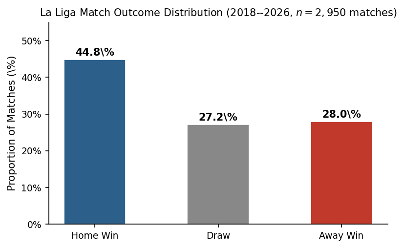
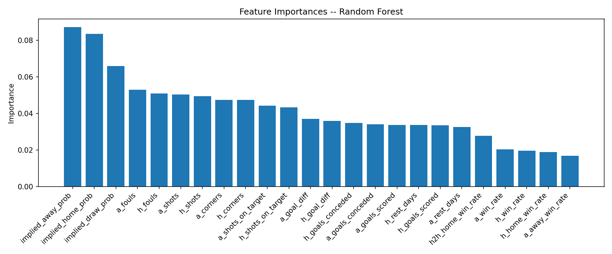
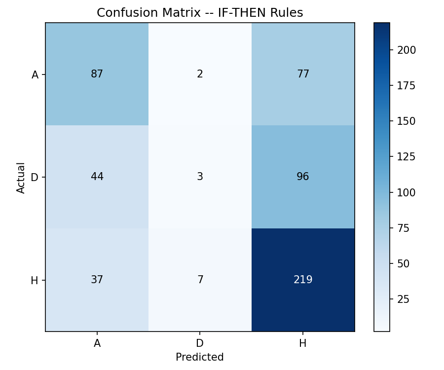

# La Liga Analytics

Predicting match outcomes and clustering team performance profiles across La Liga seasons 2018–2026.

📄 [Read the Full Report](LaLigaAnalytics.pdf)

---

## Overview

Two complementary analyses on 2,950 La Liga matches:

- **Match Outcome Classification** — predict full-time result (H/D/A) using pre-match features and betting-implied probabilities
- **Team Performance Clustering** — group all 28 clubs into performance tiers using K-Means on season-level stats

---

## Results

### Outcome Distribution

Home sides win ~46% of matches — the naïve baseline any model must beat.

### Classification

Five models were tested on a chronological 80/20 split (no future leakage). The IF-THEN Rules classifier achieved the best accuracy by directly leveraging implied probabilities from Bet365 odds.

| Model | Accuracy |
|---|---|
| Naïve Baseline (always Home) | 46.0% |
| Logistic Regression | 51.9% |
| Naive Bayes | 50.2% |
| Decision Tree | 47.2% |
| Random Forest | 53.7% |
| **IF-THEN Rules** | **54.0%** |

Implied probabilities dominate. Rolling goal difference and win rate follow. Corners and fouls contribute almost nothing.

Draws are consistently the hardest class — a known property of football prediction.

### Team Clustering

K-Means (k=3) on standardized season averages, visualized with PCA:

| Cluster | Profile | Notable Teams |
|---|---|---|
| 1 | Dominant — high goals, shots, 91% home win rate | Real Madrid, Barcelona, Atlético |
| 2 | Weaker — low output, most fouls and yellow cards | Lower-table sides |
| 3 | Mid-table — balanced across all metrics | Majority of the league |

---

## Stack

Python · Pandas · Scikit-learn · NumPy · Matplotlib
